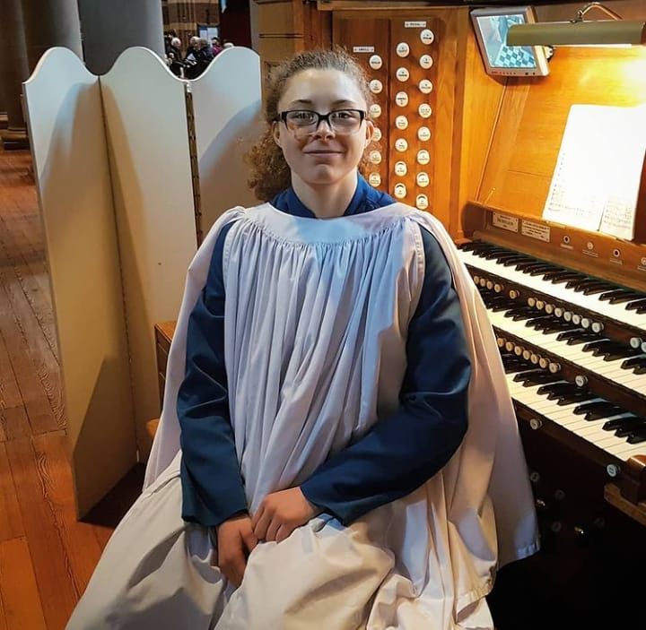

 
I am final year Cyber Security student at De Montfort University. My Github hosts my final year project CI-CD-Docker-Static-Vulnerability-analaysis</b>, which combines my knowledge of CI/CD Pipelines and DevSecOps prinicpals which I accumulated during my time as an intern at IBM.    Outside of Uni I am the current Organ Scholar at St James the Greater, I have also been a memeber of the choir since I was 10!
		
I enjoy exploring different sports, I started fencing when I was 9 and competited in many local competitions. During my second year of University I volunteered in the active program, providing staff and students and accessable and safe way to try their hand at fencing. 

I'm heavily invested in compeiting in Strongwoman at the moment, I am working with Chloe Brennan (2019 Englands strongest woman u63kg and 5th Worlds strongest woman 2021 u36kg)
